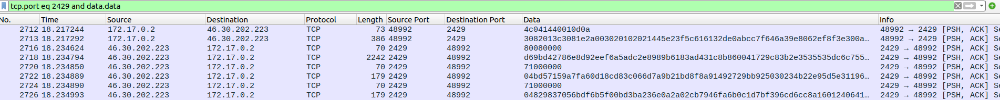

# Crypto / AEgisSecureForge (part2)

## Challenge
See part1

## Inputs
- PCAP file from part1: [aegis.pcapng](./aegis.pcapng)
- Code for a python server from part1: [server.py](./server.py)

## Solution
From the previous step, we get the code for a python server running on `TCP port 2429`.

Back to the capture log, we indeed can find some traffic on that exact port number: the IP adress of the machine is `46.30.202.223`. The host is `aegissecureforgeserver.chall.malicecyber.com`.

We can filter it out in `Wireshark` using that filter for instance:
```
tcp.port eq 2429 and ip.src eq 46.30.202.223 and data.data
```



The server implements some kind of protocol:
- Three commands available: `PROTOCOL_CMD_REGISTER`, `PROTOCOL_CMD_GET_LATEST`, `PROTOCOL_CMD_HEALTHCHECK`
- To transmit a command to the server, a client shall send 2 packets: one for the command, one for each argument
- A command packet consists of 2 `magic bytes (\x4c\x04)`, 1 byte for the command, 2 bytes for the argument length, 2 termination bytes ('\r\n')
- A argument packet consists of 4 bytes for the argument length, followed by the argument itself

The capture log shows an example of such a request: `Data: 4c041440010d0a`:
- 4c04: the magic bytes
- 14: command PROTOCOL_CMD_GET_LATEST
- 4002: the length of the argument packet (which is packed by the way)
- 0d0a: the termination bytes '\r\n

Now, looking at the code, the server will send us the flag in clear, providing we send it well-formatted packets for command `PROTOCOL_CMD_HEALTHCHECK`:
```python
    def _handle_healthcheck(self, check: bytes):
        res = b"HEALTH_OK"
        if check == b"\\x2a":
            res = open("FLAG", "rb").read()

        logger.debug(f"|>({self.peername}) HEALTHCHECK OK")
        self.transport.write(self.encode_message_length(res))
        self.transport.write(res)
        self.transport.close()
```

So let's do that and run an instance of the server locally to easily debug our code, since we have the code of the server. I use `pwntools` to interact with the server. There's no length in the argument packet, we just need to send 1 byte ('\x2a'):

```python
from pwn import *

c = remote("46.30.202.223", 2429)
#c = remote("127.0.0.1", 2429)

MAGIC_NUMBER = (1100).to_bytes(2, "little")
PROTOCOL_CMD_HEALTHCHECK = (99).to_bytes(1, "little")
SIZE_HEADER = 5
CHECK = b"\x2a"
END = b"\r\n"
HEALTH = b"HEALTH_OK"

# Send Health Check command
pkt = CHECK + END
header = MAGIC_NUMBER + PROTOCOL_CMD_HEALTHCHECK + (len(pkt) - 2).to_bytes(2, "little") + END
c.send(header)
c.send(pkt)

# Receive Health OK packet length
flag_len_bytes = c.recv(4)
flag_len = int.from_bytes(flag_len_bytes, byteorder="little")

# Receive the flag itself
flag = c.recv(flag_len).decode()
print(flag)
```

Here's the interaction with the remote server at `46.30.202.223:2429`, with `pwntools debug mode` enabled to log the packets:
```console
$ python3 healthcheck.py DEBUG
[+] Opening connection to 46.30.202.223 on port 2429: Done
[DEBUG] Sent 0x7 bytes:
    00000000  4c 04 63 01  00 0d 0a                               │L·c·│···│
    00000007
[DEBUG] Sent 0x3 bytes:
    b'*\r\n'
[DEBUG] Received 0x4 bytes:
    00000000  27 00 00 00                                         │'···│
    00000004
[DEBUG] Received 0x27 bytes:
    b'DGHACK{SeemsLike.YoureOnTheRightTrack!}'
DGHACK{SeemsLike.YoureOnTheRightTrack!}
[*] Closed connection to 46.30.202.223 port 2429
```

## Python code
Complete solution in [healthcheck.py](./healthcheck.py)

## Second flag
> DGHACK{SeemsLike.YoureOnTheRightTrack!}
