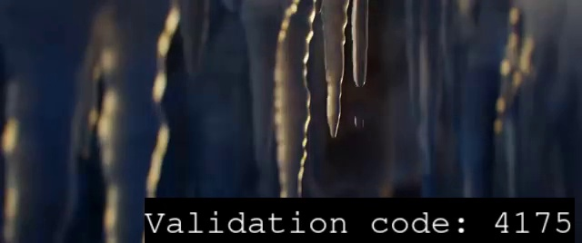

# Dev / Infinite Money Glitch

## Challenge
Ce super site permet de devenir riche en regardant des vidéos !

Comme toutes les bonnes choses, il doit bien y avoir un moyen d'en abuser...

## Inputs
- website at http://infinitemoneyglitch.chall.malicecyber.com

## Analysis
We're invited to look for videos to earn money, which we can use to get some cards. The card we want allows to buy the flag for 50€, and we only have ~30minutes available.

Each video is a mp4 stream ~30s long and containing a text inserted somewhere (timestamp may not be the same, same for the position). The inserted text is like so, for example:



And here's the example video it is extracted from: [5ca3ba41-1f72-4959-bfbc-27e3ab7ee967.mp4](./5ca3ba41-1f72-4959-bfbc-27e3ab7ee967.mp4)

The code is always 4 digits long. After watching the video, we're invited to input it. If the code is correct, we earn 0.1€.

So first things we need to be able to do:
- Download a video
- Take sample video frames at different timings where the text could be located
- Try to extract the text (hence the code) from these sample video frames
- Validate the code
- Iterate this 500 times, to earn the 50€ we need to buy the `flag card`

## Download a video
To view a video, I simply send a `GET /video` on the website. The stream location can be found in the `http` response, like in the example below. I use `BeautifulSoup` to extract it from the `html`.

```http
    <video id="video" controls>
        <source src="/stream/6dc22b20-c43a-4755-bbe3-06d24964eb3c" type="video/mp4">
        Your navigator is unable to read our videos.
    </video>
```

Here's the python code. Function `get_stream` extracts stream ID from the `html` response.

```python
HOST = "http://infinitemoneyglitch.chall.malicecyber.com"
proxies = { 'http': 'http://localhost:8080' }

def get_stream(r):
    soup = BeautifulSoup(r.content, "html.parser")
    # Get video stream
    videos = soup.find_all("video")
    for video in videos:
        #import pdb; pdb.set_trace()
        stream = video.encode().split()[4][13:-1].decode()
    return stream

def video(session, token):
    cookies = { 'token': token }
    r = session.get(HOST + "/video", cookies=cookies, proxies=proxies)
    if r.status_code == 200:
        if '/stream/' in r.text:
            stream = get_stream(r)
            return stream
        else:
            print('no video stream')
            print(r.text)
    else:
        print('get video error', int(r.status_code))
        print(r.text)
    return 0
```

To download the video, I send a `POST /stream/<stream>` with the stream ID retrieved before. I also save it as a `mp4` file on disk.

```python
def download(session, token, stream):
    cookies = { 'token': token }
    r = session.get(HOST + "/stream/" + stream, cookies=cookies, proxies=proxies, stream=True)
    if r.status_code == 200:
        # Save stream file
        stream_file = stream + ".mp4"
        with open(stream_file, 'wb') as f:
            f.write(r.content)
        print(stream, 'downloaded')
        return stream_file
    else:
        print(stream, 'download error', int(r.status_code))
        return ""
```

With this, I can now download stream files:
```console
$ python3 sol.py DOWNLOAD
5ca3ba41-1f72-4959-bfbc-27e3ab7ee967 downloaded
5401f9eb-27b7-4e7b-a93d-778f5aec7f86 downloaded
7195ee8d-d7d2-4435-aa73-48bee6765c4d downloaded
6b967dc3-ef19-44f0-bb4b-586cb10c73ae downloaded
b897421f-0720-48cd-8a05-9496479ba6ed downloaded
d5136390-e3c9-4566-9749-28edc746a154 downloaded
e09e486f-87dc-4849-a1d2-a38f1f43404a downloaded
(...)
```

## Extract the text
Since we don't know where the text has been inserted in the video, we simply take sample video frames at different timings where the text could be located. Here's the strategy I followed:
- Look at 15s, 20s first
- Look at 10s, 25s next if no code found...
- Look at 1s, 5s, 8s, 12s, 17s, 22s, 27s if still no code found...

I use `cv2.VideoCapture` to load the video stream and take sample video frames like so:
```python
    vidcap = cv2.VideoCapture(stream_file, cv2.CAP_ANY)
    for time in [15, 20, 10, 25, 1, 3, 5, 8, 12, 17, 22, 24, 27]:
        vidcap.set(cv2.CAP_PROP_POS_MSEC,time*1000)
        success, image = vidcap.read()
```

Preprocessing the image is needed, in order to easier the text extraction. Here's how I do it and the result on a sample video frame:
```python
def preprocess(image):
    # RGB to Gray scale conversion
    img = cv2.cvtColor(image, cv2.COLOR_BGR2GRAY)
    # Noise removal with iterative bilateral filter
    img = cv2.bilateralFilter(img, 11, 17, 17)
    # thresholding the grayscale image
    img = cv2.threshold(img, 0, 255, cv2.THRESH_BINARY + cv2.THRESH_OTSU)[1]
    return img
```


Then I use `pytesseract` to extract the text as follow:
```python
            text = pytesseract.image_to_string(preprocessed, lang="eng", config='--psm 6')
```

Here's the complete code:
```python
def extract(stream_file):
    code = 0
    vidcap = cv2.VideoCapture(stream_file, cv2.CAP_ANY)
    # Get some frame sample (text is not placed at the same timing)
    # Look at 15s, 20s first
    # Look at 10s, 25s next if no code found...
    # Look at 1s, 5s, 8s, 12s, 17s, 22s, 27s if still no code found...
    for time in [15, 20, 10, 25, 1, 3, 5, 8, 12, 17, 22, 24, 27]:
        vidcap.set(cv2.CAP_PROP_POS_MSEC,time*1000)
        success, image = vidcap.read()
        if success:
            # Preprocess image for easier text extraction
            # Then use tesseract to extract text: "Validation code: <code>"
            #cv2.imwrite('frame' + str(time) + 'sec.jpg', image)
            preprocessed = preprocess(image)
            #cv2.imwrite('frame' + str(time) + 'sec_prep.jpg', preprocessed)
            text = pytesseract.image_to_string(preprocessed, lang="eng", config='--psm 6')
            if "code" in text:
                s = text.split("code: ")
                if len(s) > 1:
                    if len(s[1]) >= 4:
                        candidate = s[1][:4]
                        if candidate.isdigit():
                            code = int(candidate)
                            hash = md5sum(stream_file)
                            entry = {'hash': hash, 'code': code}
                            codes.append(entry)
                            print(entry)
                            break
    vidcap.release()
    return code
```

With this, I can now successfully detect the validation code from the videos:
```console
$ for file in $(ls *.mp4); do python3 sol.py EXTRACT $file >> codes.txt; done
{'hash': '50e693b96a6b1304ee69d7acb33e84bb', 'code': 4075}
{'hash': '011da3572b0140175f1178475d32b0f3', 'code': 4175}
{'hash': 'c90709326f508738bbe81a593d547156', 'code': 1121}
{'hash': '14d1af41064087a6d8b69f0a8b4a8426', 'code': 7562}
{'hash': 'a35a37e97b445c3ce7225d1bc3e6e3fd', 'code': 4514}
{'hash': '47d3f647c31976ba321d0d85756b3a33', 'code': 4106}
{'hash': '7a6f8c15f189bd982a4bf01651e1d66a', 'code': 1382}
(...)
```

The `hash` corresponds to the ``md5sum``of the stream file. We'll get to that later on:
```console
$ for file in $(ls *.mp4); do md5sum $file; done
50e693b96a6b1304ee69d7acb33e84bb  5401f9eb-27b7-4e7b-a93d-778f5aec7f86.mp4
011da3572b0140175f1178475d32b0f3  5ca3ba41-1f72-4959-bfbc-27e3ab7ee967.mp4
c90709326f508738bbe81a593d547156  6b967dc3-ef19-44f0-bb4b-586cb10c73ae.mp4
14d1af41064087a6d8b69f0a8b4a8426  7195ee8d-d7d2-4435-aa73-48bee6765c4d.mp4
a35a37e97b445c3ce7225d1bc3e6e3fd  b897421f-0720-48cd-8a05-9496479ba6ed.mp4
47d3f647c31976ba321d0d85756b3a33  d5136390-e3c9-4566-9749-28edc746a154.mp4
7a6f8c15f189bd982a4bf01651e1d66a  e09e486f-87dc-4849-a1d2-a38f1f43404a.mp4
(...)
```

## Validate the code
Validating the code consists of sending `POST /validate` with such `json` data:

> { 'uuid': stream, 'code': code }


Here's the code to do it:
```python
def validate(session, token, stream, code):
    global validated
    cookies = { 'token': token }
    json = { 'uuid': stream, 'code': str(code) }
    r = session.post(HOST + "/validate", cookies=cookies, json=json, proxies=proxies)
    if r.status_code == 200:
        if 'Video validated' in r.text:
            validated += 1
            print(stream, 'validated', '(', str(validated), ')')
            return True
        else:
            print(stream, 'not validated')
            print(r.text)
    else:
        print(stream, 'validation error', int(r.status_code))
        print(r.text)
    return False
```

With this, we're now able to validate codes and earn some money !
```console
$ python3 sol.py VALIDATE
5401f9eb-27b7-4e7b-a93d-778f5aec7f86 downloaded
{'hash': '50e693b96a6b1304ee69d7acb33e84bb', 'code': 4075}
5401f9eb-27b7-4e7b-a93d-778f5aec7f86 validated ( 1 )
5ca3ba41-1f72-4959-bfbc-27e3ab7ee967 downloaded
{'hash': '011da3572b0140175f1178475d32b0f3', 'code': 4175}
5ca3ba41-1f72-4959-bfbc-27e3ab7ee967 validated ( 2 )
6b967dc3-ef19-44f0-bb4b-586cb10c73ae downloaded
{'hash': 'c90709326f508738bbe81a593d547156', 'code': 1121}
6b967dc3-ef19-44f0-bb4b-586cb10c73ae validated ( 3 )
(...)
```

## Threading
Of course this would be too easy:
- We can't validate the code too early: we need to wait ~20s
- We can't validate the code too late either

There, we can thread the all process. For each video, I start a 20s timer. Upon timer expiry, the `validate` function (above) is called. That way, we can `download` / `validate` in parallel, while still being on time to validate:
```python
def schedule_validation(session, token, stream, code):
    timer = Timer(20, validate, [session, token, stream, code])
    timer.start()

schedule_validation(session, token, stream, code)
```

Here it is in action: we first download files, the first validation happens after 20s, then download and validation happen in parallel:
```console
$ python3 sol.py VALIDATE
8d7b18bb-da76-4aba-b55c-63b53541fb53 downloaded
d26c5679-4c3c-46cf-9cdd-467c40279e52 downloaded
9c599b5a-db8c-4abb-a38c-c4e122c174f4 downloaded
845e3456-d541-45b3-bb89-aad89ee88b0c downloaded
(...
f9d81b0c-a8d0-4493-a2c2-a803f855a629 downloaded
ba5d1622-c6b0-4fb3-a6bd-18f98ba61161 downloaded
8d7b18bb-da76-4aba-b55c-63b53541fb53 validated ( 1 )
5b19b598-2cd2-41f2-a6fd-a6c5fa0b35d8 downloaded
d26c5679-4c3c-46cf-9cdd-467c40279e52 validated ( 2 )
e4dba481-431b-4ef7-8f7c-46844a097d1d downloaded
9c599b5a-db8c-4abb-a38c-c4e122c174f4 validated ( 3 )
(...)
```

## Too long
Problem is, it takes ages and certainly doesn't meet the target of validating 500 videos (earn 50€) in ~30minutes. The problem comes from the text extraction: we need to do it offline. I decided to download 2000 videos:

```python
def download_many(session, token, nb):
    for _ in range(nb):
        stream = video(session, token)
        stream_file = download(session, token, stream)

download_many(session, token, 2000)
```

Then I started to extract the codes from this 2000 videos and let it run overnight. The result is stored in `json` file [hash_code.json](./hash_code.json):
```console
$ for file in $(ls *.mp4); do python3 sol.py EXTRACT $file >> hash_code.json; done
```

## Not so many videos
I had already noticed that some videos were the same, although with different stream ID. Question is wether same videos also have same embedded code. That's where the `md5sum` comes into play. Let's find the unique hashes from the 2000 entries in `hash_code.json`:
```
$ cat hash_code.json | awk -F\' '{print $4}' | sort | uniq | wc -l
50
```

Oh..

Allright, so over the 2000 videos that I downloaded and from which I extracted the code, only 50 videos are actually different. So 2000 was totally overkill... But this simplifies our task quite a bit: let's keep these `50 unique (hash, code)` entries and use it as a reference. After downloading a new video, we just compute its `md5sum` and get its corresponding code from our reference entries.

Here's the function to compute the `md5sum` on a stream file:
```python
def md5sum(stream_file):
    with open(stream_file, "rb") as f:
        hash = md5(f.read()).hexdigest()
    return hash
```

## Earn money
Let's make some money. In an infinite loop, I download a new file, compute its `md5sum`, get the corresponding code from file `hash_code.json` (with 50 unique (hash / couple)), then schedule a validation 20s later:

```python
def next(session, token, hash_code_list):
    stream = video(session, token)
    stream_file = download(session, token, stream)
    hash = md5sum(stream_file)
    for hash_code in hash_code_list:
        if hash_code['hash'] == hash:
            code = hash_code['code']
            schedule_validation(session, token, stream, code)

with open('hash_code.json') as f:
     hash_code_list = json.load(f)

while(1):
	# Infinite loop
	# Buy card and get flag directly on the website when enough money...
	next(session, token, hash_code_list)
```

```console
$ python3 sol.py VALIDATE
8d7b18bb-da76-4aba-b55c-63b53541fb53 downloaded
d26c5679-4c3c-46cf-9cdd-467c40279e52 downloaded
(...)
ce75f10a-8d9f-4a80-b6c9-75a670f1142d downloaded
20447927-e6ad-44d3-9655-1a450f833124 validated ( 497 )
b0e83d47-19b3-4a45-85e2-4cd8e847e20c downloaded
d2476b30-76ec-4e6b-a075-2239debaf750 validated ( 498 )
c314e892-6987-4db9-ba7f-5ebf6e4f206e downloaded
a2056498-b379-44b7-9d3e-60f3d3ef0bcb validated ( 499 )
e2b02961-037c-43de-978b-1cdc182253fd validated ( 500 )
fa9fd76f-bf0f-4dbc-bf40-4f61e80efaaa downloaded
220146db-549f-4a7c-b733-00392157f16d validated ( 501 )
82ac58db-d54a-47ee-9b00-8832230f6107 downloaded
69d05416-1eab-4478-88d9-a9d02b4c11af validated ( 502 )
^C
```

## Get the flag
In my browser, I can manually check that I earned enough money to get the 50€ `flag card` and get the flag !

## Python code
Complete solution in [sol.py](./sol.py)

## Flag
> DGHACK{ButWhereCanIActuallySpendIt}
