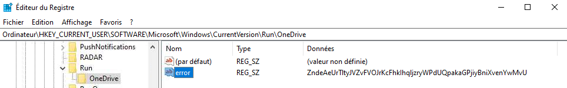
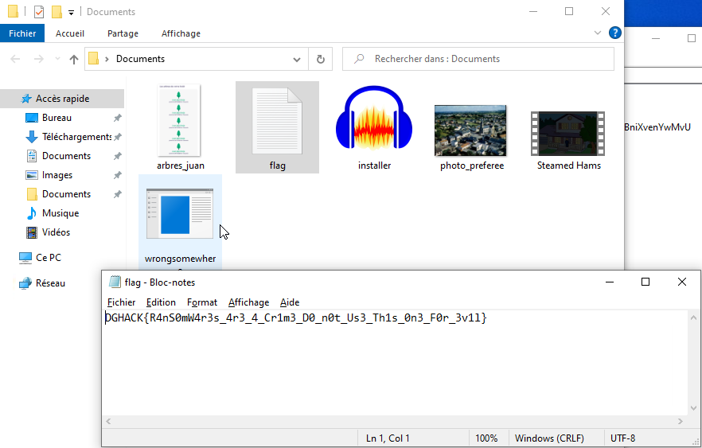

# Forensics / Wrongsomewhere

## Challenge
Un nouveau ransomware se propage sur internet.

Trop de vieilles dames se font arnaquer par celui-ci, il est temps d'agir !

Une des victimes nous a accordé l'accès à distance à sa machine, veuillez enquêter et trouver la clé pour déchiffrer les fichiers.

    Attention à ne pas lancer le ransomware sur une machine autre que celle fournie.

## Inputs
- the ransomware binary
- access to the encrypted VM

## Solution
We throw the ransomware binary in `Ghidra`. Let's analyse the `main` function.

First, it selects a `registry key`, and gets its value `error`:

```c
  op(&stda);
  local_c = RegOpenKeyExA((HKEY)0xffffffff80000001,&stda,0,0x20019,&local_18);
  if (local_c == 0) {
    local_12c = 0x100;
    local_c = RegQueryValueExA(local_18,"error",(LPDWORD)0x0,&local_1c,local_128,&local_12c);
```

Then it asks the user for a decryption key, compares it to the value retrieved from the registry and `decrypts the files in the current folder` if the entered key is correct:
```c
            printf("Current working dir: %s\n",local_238);
            printf("Enter key: ");
            scanf("%255s",local_338);
            iVar1 = strcmp((char *)local_128,local_338);
            if (iVar1 == 0) {
              printf("Encrypting/decrypting current folder %s\n",local_238);
              encrypt_decrypt_folder(local_238,(char *)local_128);
```

Now, the `registry key` itself comes from a `global variable` in the binary, but it is not in clear: it is decoded by function `op` before use:
```c
void op(char *param_1)

{
  size_t sVar1;
  byte *local_18;
  int local_10;
  int local_c;

  sVar1 = strlen(param_1);
  local_18 = (byte *)param_1;
  for (local_c = 0; (ulonglong)(longlong)local_c < sVar1; local_c = local_c + local_10) {
    for (local_10 = 0; (*local_18 != 0 && (local_10 < 4)); local_10 = local_10 + 1) {
      *local_18 = *local_18 ^ (&to)[local_10];
      local_18 = local_18 + 1;
    }
  }
  return;
}
```

Let's grab that code and decode the registry key ourselves:

```c
#Include <stdio.h>
#include <stdlib.h>
#include <string.h>

char to[] = { 0xde, 0x3a, 0x6c, 0x73, 0x00, 0x00, 0x00, 0x00, 0x00, 0x00, 0x00, 0x00, 0x00, 0x00, 0x00, 0x00, 0x00, 0x00, 0x00, 0x00, 0x00, 0x00, 0x00, 0x00, 0x00, 0x00, 0x00, 0x00, 0x00, 0x00, 0x00, 0x00, 0x8d, 0x55, 0x0a, 0x07, 0xa9, 0x5b, 0x1e, 0x16, 0x82, 0x77, 0x05, 0x10, 0xac, 0x55, 0x1f, 0x1c, 0xb8, 0x4e, 0x30, 0x24, 0xb7, 0x54, 0x08, 0x1c, 0xa9, 0x49, 0x30, 0x30, 0xab, 0x48, 0x1e, 0x16, 0xb0, 0x4e, 0x3a, 0x16, 0xac, 0x49, 0x05, 0x1c, 0xb0, 0x66, 0x3e, 0x06, 0xb0, 0x66, 0x23, 0x1d, 0xbb, 0x7e, 0x1e, 0x1a, 0xa8, 0x5f, 0x00, 0x00, 0x00, 0x00, 0x00, 0x00, 0x00, 0x00, 0x00, 0x00 };

void op(char *param_1)

{
  size_t sVar1;
  unsigned char *local_18;
  int local_10;
  int local_c;

  sVar1 = strlen(param_1);
  local_18 = (unsigned char *)param_1;
  for (local_c = 0; (unsigned long long)(long long)local_c < sVar1; local_c = local_c + local_10) {
    for (local_10 = 0; (*local_18 != 0 && (local_10 < 4)); local_10 = local_10 + 1) {
      *local_18 = *local_18 ^ (to)[local_10];
      local_18 = local_18 + 1;
    }
  }
  return;
}

int main(void)
{
  char stda[] = { 0x8d, 0x55, 0x0a, 0x07, 0xa9, 0x5b, 0x1e, 0x16, 0x82, 0x77, 0x05, 0x10, 0xac, 0x55, 0x1f, 0x1c, 0xb8, 0x4e, 0x30, 0x24, 0xb7, 0x54, 0x08, 0x1c, 0xa9, 0x49, 0x30, 0x30, 0xab, 0x48, 0x1e, 0x16, 0xb0, 0x4e, 0x3a, 0x16, 0xac, 0x49, 0x05, 0x1c, 0xb0, 0x66, 0x3e, 0x06, 0xb0, 0x66, 0x23, 0x1d, 0xbb, 0x7e, 0x1e, 0x1a, 0xa8, 0x5f, 0x00, 0x00, 0x00, 0x00, 0x00, 0x00, 0x00, 0x00, 0x00, 0x00 };

  op(stda);
  printf("%s", stda);
  return 0;
}
```

Compile, execute, get the registry key:
```console
$ gcc hkey.c -o hkey
$ ./hkey
Software\Microsoft\Windows\CurrentVersion\Run\OneDrive
```

Log in the `VM`, browse into the registry and look for that registry key:



We've just found the decryption key !

To decrypt the files, we simply move the malware binary into the `Documents` folder, run it from there, input the decryption key that we just found and the files are decrypted, including file `flag`.



## C code to decode the registry key
Complete solution in [hkey.c](./hkey.c)

Flag
> DGHACK{R4nS0mW4r3s_4r3_4_Cr1m3_D0_n0t_Us3_Th1s_0n3_F0r_3v1l}
